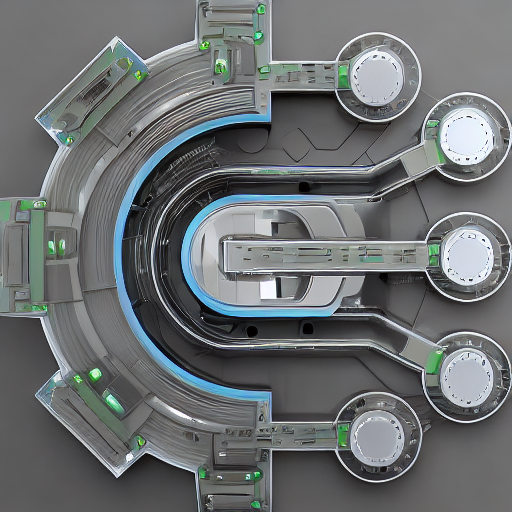
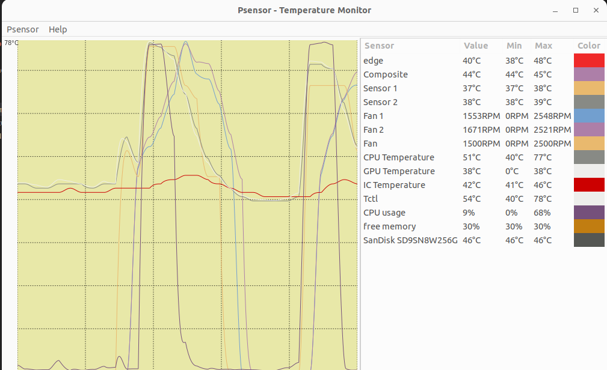

# Lenovo Legion Linux

[](https://github.com/johnfanv2/LenovoLegionLinux/actions/workflows/build.yml)
[](https://discord.com/invite/legionseries)
[](https://www.reddit.com/r/LenovoLegion/)
[](https://www.reddit.com/r/linuxhardware/)

---
**This project is not affiliated with Lenovo in any way**

Lenovo Legion Linux (LLL) brings additional drivers and tools for Lenovo Legion series laptops to Linux. It
is the alternative to Lenovo Vantage or Legion Zone (both Windows only).

It allows to control a few features like fan curve and power mode.

:star: **Please star this repository if this is useful or might be useful in the future.**

:star2: **My goal is to merge the driver into the main Linux kernel so it comes automatically with Linux and no recompilation is required after a Linux update**

:boom: **Starring shows that this is useful to me and the Linux community so hopefully a merge into the Kernel is possible.**

## :rocket: Features
<p align="center">
    
    
    
</p>

- [x] light on RAM and CPU and without telemetry
- [x] small GUI for fan curve; other features by GUI tools of distribution
- [x] also fully controllable by scripts or from terminal
- [x] set a fully featured custom fan curve with up to 10 points
    - even allows speed below 1600 RPM
    - set temperature points when the fan speed (level) should change
    - you can use CPU, GPU and IC temperature to control the fan all at the same it
    - set the fan speed (RPM) at each level
    - set minimum temperature for each level that must be fallen below before slowing down the fans again
    - set acceleration and deceleration for each the fan when the fan speed should increase or decrease
    - save and load presets for different modes
- [x] switch power mode (quiet, balanced, performance) with software
    - changing with `Fn+Q` also possible
    - now you can do it with software in your normal system settings
    - depending on your distribution, e.g. you could automatically switch to quiet mode if you are on battery
- [x] monitor fan speeds and temperatures (CPU, GPU, IC) with additional sensors
- [x] lock and unlock the fan controller and fan speed
- [x] enable or disable automatic switching to a "mini fan curve" if temperatures are low for a longer time
- [x] switch battery conservation mode by software; keep battery at around 50% when on AC to prolong battery life
- [x] toggle fn lock by software; use special function on F1-F12 keys without pressing Fn key
- [x] enable or disable touchpad by software

## :mega: Overview
- it comes with a driver (kernel module) that implements the Linux standard interfaces (sysfs, debugfs, hwmon) 
- using standard Linux interfaces makes it is compatible with the command line/file interface or standard GUI tools like psensor
- compared to vendor tools for Windows, it even allows to set the fan curve. This allows to keep the fans
    slowly and quietly running instead of constantly switching between fans off and loud fans. Perfect for quiet office work. :office:


## :pushpin: Confirmed Compatible Models
Other Lenovo Legion models from 2020 to 2023 probably also work. The following were confirmed. If you have a model with a BIOS version with the same leading letters, e.g. EFCN (like EFCN54WW) then it will probably work. If your model is not in the list or it does not work, please raise a issue.
- Lenovo Legion 5 15IMH05, 15IMH05H (BIOS EFCN54WW): sensors, fan curve, power profile
- Lenovo Legion 5 15ACH6H (BIOS GKCN58WW or GKCN57WW), Gen 6: sensors, fan curve, power profile
- Lenovo Legion R9000 (R9000K2021H) (BIOS GKCN59WW): sensors, fan curve, power profile
- Lenovo Legion 5 Pro 16ACH6H (82JQ) (BIOS GKCN58WW) x 2: sensors, fan curve, power profile
- Legion 5 Pro 16ACH6H (AMD 5800H + Nvidia RTX 3070): sensors, fan curve, power profile
- Lenovo Legion 5 15ARH05A (BIOS FSCN14WW), Gen 5: sensors, fan curve
- Lenovo Legion 5 15ARH05H (BIOS FSCN14WW), Gen 5: sensors, fan curve
- Lenovo Legion 5 15ITH6H (BIOS H1CN49WW, Intel): sensors, fan curve, power profile
- Lenovo Legion 5 15ARH7H (BIOS JUCN55WW), Gen7: sensors, fan curve, power profile
- Lenovo Legion 5 15ACH6 (BIOS HHCN31WW): sensors, fan curve, power profile
- Lenovo Legion S7 16ARHA7 (BIOS KFCN32WW): sensors, fan curve (no minifancurve), power profile
- Lenovo Legion 5 Pro 16ITH6 (BIOS H1CN52WW (there was an error in CPU temp with H1CN51WW)): sensors, fan curve, power profiles
- Lenovo Legion 5 15ACH6A (BIOS G9CN30WW), all AMD variant: sensors, fan curve (with mini fan curve), power profile
- Lenovo Legion 7 17ACH6 (BIOS HHCN31WW): sensors, fan curve, power profile

*Note:* Features that are not confirmed probably also work. They were just not tested.

Currently fan control is not working for the following models. Other features, probably work:
- Legion with BIOS HACN*, e.g. S7-15ACH6: [Issue](https://github.com/johnfanv2/LenovoLegionLinux/issues/13)
- Legion Y530 and Legion Y540: [Issue](https://github.com/johnfanv2/LenovoLegionLinux/issues/16)

## :warning: Disclaimer

- **the tool comes with no warranty. Use at your own risk.**
- **this project is not affiliated with Lenovo in any way.**
- this is a small hobby project; please be patient and read through this readme carefully before you ask for support
- if your Lenovo Legion laptop is not supported and you are ready to perform some tests please notify me
- this is a Linux only tool and will probably not run in WSL; for Windows use one of the available Windows tools
    - [LenovoLegionToolkit](https://github.com/BartoszCichecki/LenovoLegionToolkit)
    - [LegionFanControl](https://www.legionfancontrol.com/) 


## :bulb: Instructions
Please do the following: 
- **follow installation instructions**
- **then make the test**
- **if tests are successful, install permanently**
- **create your fan curve**

### Requirements
You will need to install the following to download and build it. If there is an error of any package, find the alternative name in your distribution and install them.

**Ubuntu/Debian/Pop!_OS/Mint/elementary OS/Zorin**
```bash
sudo apt-get update
sudo apt-get install -y make gcc linux-headers-$(uname -r) build-essential git lm-sensors wget python3-pyqt5 python3-yaml python3-venv python3-pip python3-argcomplete
# Install the following for installation with DKMS
sudo apt-get install dkms openssl mokutil
```

**RHEL/CentOS/RockyLinux/Fedora/AlmaLinux**
```bash
sudo dnf install -y kernel-headers kernel-devel dmidecode lm_sensors PyQt5 python3-yaml python3-pip python3-argcomplete
sudo dnf groupinstall "Development Tools"
sudo dnf group install "C Development Tools and Libraries"
# Install the following for installation with DKMS
sudo dnf install dkms openssl mokutil
```
Alternatively, you might use `yum` instead of `dnf` and start with `sudo yum update`. Installing "C Development Tools and Libraries" might not be needed depending of your distribution.


**openSUSE**
```bash
sudo zypper install make gcc kernel-devel kernel-default-devel git libopenssl-devel sensors dmidecode python3-qt5 python3-pip python3-PyYAML python3-argcomplete
# Install the following for installation with DKMS
sudo zypper install dkms openssl mokutil
```
*Note:* Check for the correct Header package.


**Arch/Manjaro/EndeavourOS**
```bash
sudo pacman -S linux-headers base-devel lm_sensors git dmidecode python-pyqt5 python-yaml python-argcomplete
# Install the following for installation with DKMS
sudo pacman -S dkms openssl mokutil
```
*Note:* Check for the correct Header package.

Troubleshooting: 
- Got error `ERROR: Kernel configuration is invalid.`. Just reinstall kernel headers, e.g. in Debian:
```bash
sudo apt install --reinstall linux-headers-$(uname -r)
```

### Build and Test Instruction
```bash
git clone https://github.com/johnfanv2/LenovoLegionLinux.git
cd LenovoLegionLinux/kernel_module
make
sudo make reloadmodule
```
**For further insturctions, problems, and tests see `Initial Usage Testing` below. Do them first before a permanent installation.**

Expected result:
- `make` finishes without displaying `Error`

Unexpected result:
- `make` aborts with an error
- an error of kind `/lib/modules/XXXXXXXX/build: No such file or directory` like the following below. This means that the linux-headers are not installed properly for the current kernel. Please check your currrent kernel with `uname -r` and install linux-headers for it. Then there will be a directory `/lib/modules/XXXXXXXX/` where XXXXXX is the current kernel version, e.g. `5.19.0-28-generic` or `6.2.9-arch1-1`. If you have just updated your packages a restart might help or see https://bbs.archlinux.org/viewtopic.php?id=135931, https://forum.manjaro.org/t/missing-build-directory-in-5-15-16-1-manjaro-headers/101793.
```text
make[1]: *** /lib/modules/6.2.9-arch1-1/build: No such file or directory.  Stop.
make[1]: Leaving directory '/home/user/LenovoLegionLinux/kernel_module'
make: *** [Makefile:13: all] Error 2
```
      


### Permanent Install Instruction
After successfully building and testing (see below), run from the folder `LenovoLegionLinux/kernel_module`
```bash
make
sudo make install
```
**You must recompile and reinstall it again with above commands after each kernel update, as usual for external kernel modules.**
I want to get it merged into the mainline Linux kernel, so this is not needed anymore. So please star this repository :)


### Uninstall Instruction
Go to the folder `LenovoLegionLinux/kernel_module`
```bash
make
sudo make uninstall
```

### Installing via DKMS
> DKMS is a utility that eliminates the need to manually rebuild and reinstall the driver after every kernel update. DKMS will do the reinstallation automatically.

You must first install the package to with DKMS. See Requirements section. 
```
sudo cp ./kernel_module/* /usr/src/LenovoLegionLinux-1.0.0 -r
sudo dkms add -m LenovoLegionLinux -v 1.0.0
sudo dkms build -m LenovoLegionLinux -v 1.0.0
```
Or via makefile
```
cd kernel_module
sudo make dkms # Don't forget to run as root
```

Or you can just use the script:
```
cd deploy
sudo ./build-dkms.sh  # Don't forget to run as root
```

#### Secure boot
If you want the driver to work with secure boot, then follow the steps described here
https://github.com/dell/dkms#secure-boot.
### Uninstalling via DKMS
```
sudo dkms remove -m LenovoLegionLinux -v 1.0.0
reboot
```

### Permanently Patching the Kernel
This is only useful for advanced users that build there own kernel. A automatically generated patch is provided on the 
release page whenver a stable milestone has been reached: [Releases]( https://github.com/johnfanv2/LenovoLegionLinux/releases) 

## :octocat: Initial Usage Testing
Please note:
- Please test in the given order; try to fix a failed text before going to the next. 
- These tests are manual and in the terminal because this is an early version of this tool
- You can copy-and-paste the commands. Paste with `Ctrl+Shift+V` inside the terminal.

### Quick Test: Module is properly loaded
```bash
# After you have run from folder LenovoLegionLinux/kernel_module
sudo make reloadmodule (for non DKMS)

# Check the kernel log
sudo dmesg
```
Expected result: 
- You should see a line like the following like `legion PNP0C09:00: legion_laptop loaded for this device`. `PNP0C09` might be replaced by other text.

Unexpected result:
- `insmod: ERROR: could not insert module legion-laptop.ko: Invalid module format` after running `make reloadmodule`
- `legion PNP0C09:00: legion_laptop not loaded for this device`. The kernel module was not loaded properly. Redo first test.
- `insmod: ERROR: could not insert module legion-laptop.ko: Key was rejected by service`: because you enable secure boot, you cannot load kernel modules.   Disable secure boot (in BIOS) or sign the kernel module with a private key.
- if you see the following, the driver was not tested for your laptop model; please raise an issue with the maintainer if you think it should be compatible. If you want to try it anyhow with your model use `sudo make forcereloadmodule`
```text
[126675.495983] legion PNP0C09:00: Module not useable for this laptop because it is not in allowlist. Notify maintainer if you want to add your device or force load with param force.
[126675.495984] legion PNP0C09:00: legion_laptop not loaded for this device
[126675.496014] legion: probe of PNP0C09:00 failed with error -12
```

### Quick Test: Reading Current Fancurve from Hardware
```bash
# Read the current fancurve and other debug output
sudo cat /sys/kernel/debug/legion/fancurve
```

Expected output:
- EC Chip ID should be 8227
- "fan curve points" size must NOT be 0
- the table that shows the current fan curve must NOT be only zeros, the actual values might change
- "fan curve current point id" and "EC Chip Version" might differ from the example
    
Example:
```text
EC Chip ID: 8227 
EC Chip Version: 2a4 
fan curve current point id: 0 
fan curve points size: 8 
Current fan curve in UEFI
rpm1|rpm2|acceleration|deceleration|cpu_min_temp|cpu_max_temp|gpu_min_temp|gpu_max_temp|ic_min_temp|ic_max_temp
0 0 2 2 0 48 0 59 0 41
1700 1900 2 2 45 54 55 59 39 44
1900 2000 2 2 51 58 55 59 42 50
2200 2100 2 2 55 62 55 59 46 127
2300 2400 2 2 59 71 55 59 127 127
2600 2700 2 2 68 76 55 64 127 127
2900 3000 2 2 72 81 60 68 127 127
3500 3500 2 2 78 127 65 127 127 127
```

The fan curve is displayed as a table with the following columns:
```text
rpm1: speed in rpm for fan1 at this point
rpm2: speed in rpm for fan1 at this point
acceleration: acceleration time (higher = slower)
deceleration: deceleration time (higher = slower)
cpu_min_temp: CPU temperature must go below this before leaving this point
cpu_max_temp: if CPU temperature is above this value, go to next point 
gpu_min_temp: GPU temp must go below this before leaving this level
gpu_max_temp: if GPU temperature is above this value, go to next point 
ic_min_temp: IC temp must go below this before leaving this level
ic_max_temp: if IC temperature above this value, go to next point 

All temperatures are in degree Celsius.
```
**Note**: This is just a debug output. The fan curve is configured as usual using the standard `hwmon` interface.


Unexpected:
- `/sys/kernel/debug/legion/fancurve: No such file or directory`: Kernel module was not loaded properly
- `cat: /sys/kernel/debug/legion/fancurve: Permission denied` you have forgot sudo

### Quick Test: Read Sensor Values from Hardware
- display sensor values and check that it contains lines with "Fan 1", "Fan 2", "CPU Temperature", "GPU Temperature":
```bash
# Run the command sensors
sensors
```
- display sensor values
- increase the CPU load and check if 
    - displayed CPU temperature increases
    - displayed fan speed increases 
- display sensor values
- increase the GPU load and check if GPU temperature changes
    - displayed CPU temperature increases
    - displayed fan speed increases 

Expected output:
- Output of `sensors` contains something like
    ```text
    legion_hwmon-isa-0000
    Adapter: ISA adapter
    Fan 1:           1737 RPM
    Fan 2:           1921 RPM
    CPU Temperature:  +42.0°C  
    GPU Temperature:  +30.0°C  
    IC Temperature:   +41.0°C  
    ```
- if GPU is in deep sleep, its reported temperature is 0; run something on the GPU to test it
- temperatures are valid: in particular not 0 (except GPU see above)
- fan speeds are valid: if fan is off it is 0, otherwise greater than 1000 rpm
- temperatures and fan speeds increase as expected

Unexpected output:
- `Command 'sensors' not found`: Install `sensors` from the package `lm-sensors`     
- no entries for "Fan 1", "Fan 2" etc. are shown. The kernel module was not loaded properly. Redo first test.
    

### Quick Test: Change Current Fan Curve from Hardware with hwmon
```bash
# Change the RPM of fans at the second and third point of the fan curve to 1500 rpm, 1600 rpm, 1700 rpm, 1800 rpm.
# Get root
sudo su
# As root enter
# 2. point, 1. fan
echo 1500 > /sys/module/legion_laptop/drivers/platform:legion/PNP0C09:00/hwmon/hwmon*/pwm1_auto_point2_pwm
# 2. point, 2.fan
echo 1600 > /sys/module/legion_laptop/drivers/platform:legion/PNP0C09:00/hwmon/hwmon*/pwm2_auto_point2_pwm
# 3. point, 1. fan
echo 1700 > /sys/module/legion_laptop/drivers/platform:legion/PNP0C09:00/hwmon/hwmon*/pwm1_auto_point3_pwm
# 3. point, 2.fan
echo 1800 > /sys/module/legion_laptop/drivers/platform:legion/PNP0C09:00/hwmon/hwmon*/pwm2_auto_point3_pwm


# Read the current fancurve and check if changes were made
cat /sys/kernel/debug/legion/fancurve
```
Expected: 
- the controller might have loaded default values if you pressed Ctr+Q(or FN+Q on certain devices) to change the power mode or waited too long; then try again
- The entries in the fan curve are set to their values. The other values are not relevant (marked with XXXX)
```
rpm1|rpm2|acceleration|deceleration|cpu_min_temp|cpu_max_temp|gpu_min_temp|gpu_max_temp|ic_min_temp|ic_max_temp
XXXX XXXX XXXX XXXX XXXX XXXX XXXX XXXX XXXX XXXX
1500 1600 XXXX XXXX XXXX XXXX XXXX XXXX XXXX XXXX
1700 1800 XXXX XXXX XXXX XXXX XXXX XXXX XXXX XXXX
XXXX XXXX XXXX XXXX XXXX XXXX XXXX XXXX XXXX XXXX
XXXX XXXX XXXX XXXX XXXX XXXX XXXX XXXX XXXX XXXX
XXXX XXXX XXXX XXXX XXXX XXXX XXXX XXXX XXXX XXXX
XXXX XXXX XXXX XXXX XXXX XXXX XXXX XXXX XXXX XXXX
XXXX XXXX XXXX XXXX XXXX XXXX XXXX XXXX XXXX XXXX
```

**If you want to reset your fan curve, just toggle with Ctrl+Q the power mode or restart and everything is gone.**

Unexpected: 
- `file not found`: please report your problem as a Github Issue
- the values have not changed
- there are different values


### Quick Test: Set your custom fan curve
Set a custom fan curve with the provided script. See `Creating and Setting your own Fan Curve` below.


### Test: Finish
- If you are satisfied with the test results, then you can install the kernel module permanently (see above).
- Create a GitHub Issue and report if the test work or fail. 
    - Please include exact laptop model
    - If errors occurred, include output of commands.
- You also might to want to star this repository

## :computer: Normal Usage
**you have to install the kernel module permanently (see above), otherwise you must reload it manually after each restart**

### Temperature and Fan Monitoring
The temperatures and fan speeds should be displayed in any graphical tool that monitors them, e.g. psensor. You have to install it first before running:
```bash
psensor
```
<p align="center">
    
</p>

### Changing and Setting your own Fan Curve with the Python GUI
Start the GUI as root
```bash
# run from folder LenovoLegionLinux
sudo python/legion_linux/legion_gui.py
```
<p align="center">
    
</p>


- with `Read from HW` you can read the current fan curve that is saved in the hardware and display it.
- you can edit the values of the fancurve. They will not applied to hardware until your press `Apply to HW`
- press `Apply to HW` to write the currently displayed fancurve to hardware and activate it
- you can load and save a fancurve to a preset. Select the preset with the drop-down menu and press `Load from Preset` or `Save to preset`.  
- loading a preset will just display it. You still have to press `Apply to HW` to activate it
- presets are stored in a yaml file in `/root/.config/legion_linux/`. You can edit them also manually.
- the number of points is fixed depending on power mode. Deactivated points are currently displayed as `0`s.
- lock fan controller: enabling this will freeze the current fan speed and the temperatures used to control the fan controller

Unexpected:
- an error is displayed or everything is `0`: kernel module not loaded or installed (see above) or not compatible (do manual tests from above)
- an value is not accepted when `Write to HW`: the value is out-of-range and was not accepted by hardware
    
### Changing and Setting your own Fan Curve with the Python CLI
You can do the same as the GUI from a CLI program. It will access the same presets.
```bash
# run from folder LenovoLegionLinux
sudo python/legion_linux/legion_cli.py
```

```text
usage: legion_cli.py [-h] {fancurve-write-preset-to-hw,fancurve-write-hw-to-preset,fancurve-write-file-to-hw,fancurve-write-hw-to-file} ...

Legion CLI

options:
  -h, --help            show this help message and exit

subcommands:
  {fancurve-write-preset-to-hw,fancurve-write-hw-to-preset,fancurve-write-file-to-hw,fancurve-write-hw-to-file}
    fancurve-write-preset-to-hw
                        Write fan curve from preset to hardware
    fancurve-write-hw-to-preset
                        Write fan curve from hardware to preset
    fancurve-write-file-to-hw
                        Write fan curve from file to hardware
    fancurve-write-hw-to-file
                        Write fan curve from hardware to file
```

### Creating and Setting your own Fan Curve with Script
Just run the script to set the fan curve. It is in the folder `LenovoLegionLinux`.
```bash
# Go to folder LenovoLegionLinux and run it. It should output "Writing fancurve successful!" if it finishes successful
sudo ./setmyfancurve.sh
# And check new fan curve
sudo cat /sys/kernel/debug/legion/fancurve
```
Open the file `setmyfancurve.sh` and edit it to adapt the values in the script to create your own fan curve. Follow the description in the file.

Unexpected output:
- `bash: ./setmyfancurve.sh: Permission denied`: You have to make the script executable with `chmod +x ./setmyfancurve` first
- script does not end with "fancurve set": maybe path to hwmon changed; Please report this

Note: 
- **If you want to reset your fan curve, just toggle with Ctrl+Q the power mode or restart and everything is gone.**
- Currently, there is no GUI available. 
- Currently, the hardware resets the fan curve randomly or if you change power mode, suspend, or restart. Just run the script again. 
- You might want to create different scripts for different usages. Just copy it and adapt the values.

### Change power mode from software
For this to work, you must install the kernel module permanently (see above). Alternatively, you can restart the the power daemon (`systemctl reload power-profiles-daemon.service` in Ubuntu) after reloading the kernel module (see above).

#### Modify/Control with GUI
In Ubuntu/Gnome go to `Settings->Power->Power Mode/Power Saving Option` or the applet in the top right.
<p align="center">
    
</p>
Automatic change of power mode can be changed in the settings of the distribution ( in Ubuntu).


#### Modify with CLI
```bash
# List all profiles (power-saver = quiet= blue)
powerprofilesctl list

#   performance:
#     Driver:     platform_profile
#     Degraded:   no

#   balanced:
#     Driver:     platform_profile

# * power-saver:
#     Driver:     platform_profile

# Set a profile, e.g. balanced
powerprofilesctl set balanced
```

Alternatively, you can also directly access it on a lower level:
```bash
# Access current profile
cat /sys/firmware/acpi/platform_profile

# Change current profile (AS ROOT): available modes quiet, balanced, performance
echo balanced > /sys/firmware/acpi/platform_profile
```

### Enable or disable the mini fan curve
If the laptop stays cool for a longer time, it will enable the "mini fan curve", a special fan curve with only a few points. It will usually spin the fans. You can enable or disable that. If you want to use your configured fan curve in any case, disable it. The mini fan curve is not available on all models (you will see error for mini fan curve when running `cat /sys/kernel/debug/legion/fancurve`).

With the GUI, the mini fan curve is enabled/disabled by checking/unchecking the box `Minifancurve if cold` and pressing `Apply to HW`.

### Lock and Unlock the Fan Controller and Fan Speed

You can lock the current fan speed. If it is locked, the fan speed will stays constant and does not react to temperature changes. You might want to lock the fan at a high speed during a game. I would not recommend keeping it locked all the time. If your fan controller gets locked accidentally, e.g. by Windows tools, you can unlock it. A locked fan controller might be the reason for a non-working fan control. If the fan controller is locked, the additional temperature sensors are not updated anymore and also stay constant.

With the GUI, the fan controller is locked by checking the box `Lock fan controller` and pressing `Apply to HW`.

### Set Speed to Maximum Fan Speed
The fan can be set to maximum fan speed regardless of temperature. This is sometimes called extreme cooling mode or dust cleaning mode. Do not enable this for long periods of time, because it might degrade your fans faster.

With the GUI, the current fan speed is set to the maximum possible value by checking `Set speed to maximum fan speed` and pressing `Apply to HW`.

This is currently not available in many models. 


### Set Battery Conservation Mode to Prolong Battery Life when AC is plugged in
You can enable battery conservation mode. When conservation mode is enabled, the constant charging of the battery is disabled when the AC (charger) is plugged in. It will try to keep your battery state of charge at around 50%. This is said to prolong the battery life. 

With the GUI, the battery conservation is enabled by checking the box `Battery conservation` (changes should apply immediately).

### Toggle Fn lock to use special functions on F1-F12 keys without pressing Fn key
You can lock the Fn keys. You can do it by pressing Fn+Esc. This should also toggle the light in the Esc key (if available in your model). 
If enabled, the special functions, e.g. increase sound volume on F3, is triggered without pressing Fn.

With the GUI, the Fn-lock is enabled/disabled by checking/unchecking the box `Fn Lock` (changes should apply immediately).

### Enable/Disable Touch Pad
You can enable or disable the touch pad. You can do it by pressing Fn+F10 (or similar). 

With the GUI, the touch pad is enabled/disabled by checking/unchecking the box `Touch Pad Enabled` (changes should apply immediately).


## Known Bugs
Some bugs cannot be fixed due to the firmware in the hardware:
- size of fan curve cannot be changed (size is 10 on performance mode, 9 otherwise) but you can practically disable points by setting the temperature limits to 127, as already done when writing to `auto_points_size`


## :clap: Credits

### Basis of this work
Thank you for your work on Windows tools that were the basis of the Linux support:
* [SmokelessCPU](https://github.com/SmokelessCPUv2), for reverse engineering the embedded controller firmware
    and finding the direct IO control method to communicate with the embedded controller
* [FanFella](https://github.com/SmokelessCPUv2), for finding the address to lock or unlock the fan controller
* [Bartosz Cichecki](https://github.com/BartoszCichecki), for creating [LenovoLegionToolkit](https://github.com/BartoszCichecki/LenovoLegionToolkit), a Windows tool for newer Legion models that controls the Laptop with ACPI/WMI methods. Even this README is heavily inspired on it.
* [0x1F9F1](https://github.com/0x1F9F1), for reverse engineering the fan curve in the embedded controller firmware 
    and creating the Windows tool [LegionFanControl](https://github.com/0x1F9F1/LegionFanControl)
* [ViRb3](https://github.com/ViRb3), for creating [Lenovo Controller](https://github.com/ViRb3/LenovoController), which was used as a base 
    for [LenovoLegionToolkit]
* [Luke Cama](https://www.legionfancontrol.com/), for his closed-source tool [LegionFanControl](https://www.legionfancontrol.com/) that controls older laptops with directly with the embedded controller 
* David Woodhouse, for his work on the ideapad Linux driver [ideapad-laptop](https://github.com/torvalds/linux/blob/0ec5a38bf8499f403f81cb81a0e3a60887d1993c/drivers/platform/x86/ideapad-laptop.c), which was a heavy inspiration for this Linux driver

### Contributors to Lenovo Legion Laptop Support
Thank you for your contribution for the Linux support:
* [normaneye](https://github.com/normaneye), fixing GPU temperature bug in GUI
* [Petingoso](https://github.com/Petingoso), fix script to run withou sudo
* [XenHat](https://github.com/XenHat), fix README

Also please tell me if it works or does not work on your laptop.


## :interrobang: Frequency Asked Questions

### What are the new temperatures?
These are the temperatures measured and used by the embedded controller. Only they are relevant for the fan controller.
They are provided by the new kernel module and otherwise not accessible because they are read from the embedded controller.

### What are the new fan speed sensors?
They report the fan speed in rounds per minute (rpm). They are provided by the new kernel module and otherwise not accessible because they are read from the embedded controller.

### What temperatures are used for controlling the fan speed?
The CPU, GPU, and "IC" temperature is used. These are (usually) additional sensors that are different from the temperature sensors that are reported when you do not use the kernel model. In particular, the "IC" temperature limit might be set to a low value which results in almost-always running fans.

### My CPU and GPU temperatures are low but the fan is still running?
See above. In particular, the  "IC" temperature sensor.

### Is the fan speed controlled by power consumption?
I have no reason to believe that. As far as I know and observed, only the temperatures are used.


### My fans do not spin up, never stop, or never change speed (after using other tools)?

If they always have roughly constant speed, maybe you have locked the fan controller, often called locking fan speed.
You can unlock/lock the fan speed controller in the GUI (see above). I would recommend not locking them. Doing 
a BIOS/UEFI update usually also unlocks it. But beware and consider making a BIOS (re)-update.

If the fans never spin up fast even under hight load, the fan controller might be locked (above). Additionally,
also check that the reported temperatures for CPU (or GPU) really increase under load. Only, the temperatures
"CPU Temperature", "GPU Temperature", and "IC Temperature" are used for fan control. These, are used internally
by the fan controller in hardware.

If otherwise the fans never stop, you might have set a very low upper temperature limit for CPU, GPU or IC. Many
models also come with a low temperature limit even on quiet mode, so fans never really turn off. You can just increase the temperature
limits for the lowest level.

### The fans of the Legion Laptop are loud when idle?
See above.

### The fans turn on when doing light work like browsing?
Even when browsing there might be small bursts of work for the CPU. So it gets hot for a short time and the fans turn on. You can
- change the fan curve, in particular increase temperature limit and increase acceleration time
- disable CPU boost mode
- also see above


### The reported temperatures do not change or seem wrong?

See above.

### Even under high load the fans are going not fast enough?

See above.

### After a BIOS update something, e.g. with the fans, does not work anymore?
Maybe there was a problem during the BIOS update. Downgrade to a older version again. Then test it with the old version. Then do the BIOS upgrade again and check with the version.

### How to do a BIOS upgrade or reset the embedded controller to fix a problem?
The easiest way is to downgrade to a older version and then upgrade to the current version again. Also test it with the old version.
You can also just try reset the embedded controller with:
- shutdown laptop, unplug everything (charger, USB, ...)
- press AND HOLD power button for 60 seconds; keep holding even if the it turns on
- after 60 seconds release power button
- press power button shortly to turn laptop on


### What does quiet, balanced, or performance mode do?
You can switch the mode by pressing Fn + Q and it will change the mode in the firmware and the color of the LED, even without any driver support (= without Lenovo Legion Linux).

Changing mode without Lenovo Legion Linux is purely implemented in hardware:
- color of LED changes
- fan curve in embedded controller changes
- other purely hardware configs might also change, but I have not observed one
- as far as I know, power saving or performance of CPU does not change, as this is controlled by kernel or tools like cpupower
- without Lenovo Legion Linux the kernel or other system tools will not know that you have changed the mode

Changing mode with Lenovo Legion Linux:
- it changes all of the above 
- additionally the driver in Lenovo Legion Linux makes this information available to the kernel and other services like the Power Profiles daemon; these can, if configured, change the performance of the CPU or GPU

In Windows it is similar: Changing the power mode is reported to the system or tools like Vantage which change the power plan.

### Should I use balanced mode or performance for gaming?
The difference in usable performance (FPS) is minimal. Use performance mode to get the utmost highest performance, otherwise use balanced mode.

### One fan runs at full speed all the time. What should I do?
First check that the fan curve is set properly and this is not a misconfiguration. Then check if the temperatures used for fan control (see "new temperatures" above) have low values on idle. If just one fan is on full speed but the other one is controlled according to fan curve, then you
should reset the BIOS and EC controller. 

### What is "advanced thermal optimization" in the BIOS/UEFI?
You can change the fan curve and minimal fan speed that are programmed into the hardware
- off: turn off fan if cold enough
- level 1: minimal fan speed level 1
- level 2: minimal fan speed level 2
- level 3: minimal fan speed level 3

also see: https://forums.lenovo.com/t5/Gaming-Laptops/Legion-7-Bios-What-is-advanced-thermal-optimization/m-p/5079357?clickid=xtRyKHRPaxyNR1ay4ywCuSBLUkA1nmX5DzV4UU0&irgwc=1&PID=121977&acid=ww%3Aaffiliate%3Abv0as6&cid=us%3Aaffiliate%3Acxsaam

### I do not use GNOME (or Ubuntu). How do I get a nice applet for changing the power mode?
The power mode can be changed with Fn+Q. Additionally, this driver makes it available to default tools like power-profiles-daemon. A graphical
 GNOME applet uses power-profiles-daemon to change the power mode by software. It is not provided by this tool, but is a standard tool already integrated into GNOME. For KDE there is the graphical tool powerdevil, which also uses power-profiles-daemon internally. If you just want to change it by software and do not need a GUI, you could use the commandline (see README).

Maybe power-profiles-daemon or this applet need to be installed first. To test that it works in principal, you try changing with the CLI, see "Powermode -> Modify with CLI" in the README. If this works, than the rest is just a matter of the (KDE/GNOME/...) applet.


### It almost works, but (some) temperature sensor/chaning point in fan control/ (some) fan speed is not working. What should I do?
First, try to reset the embedded controller (see above) or do a BIOS update (even downgrade/upgrade possible) to reset everything.


### It does not work after a Linux (kernel) update?
Please recompile/reinstall, see Permanent Install Instructions. 

### My screen is dimmed after a time of inactivity even if I disabled that in Ubuntu. How to fix that?
```bash
gsettings set org.gnome.settings-daemon.plugins.power idle-brightness 100
```
see https://www.reddit.com/r/linuxquestions/comments/utle2w/ubuntu_2204_is_there_a_way_to_disable_screen/


## :question: Open Questions
- What exactly is the third temperature? Currently, it is currently called IC Temperature.
- Can I use quiet mode for gaming?

## :information_desk_person: Overview for Developers
The software consists of two parts:
- kernel module in folder `kernel_module`
    - accesses embedded controller by writing to its memory
    - creates new "files" `/sys/kernel/debug/legion/fancurve`, `/sys/module/legion_laptop/drivers/platform\:legion/PNP0C09\:00/powermode` , 
        `/sys/class/hwmon/X/temp1_input`, `/sys/class/hwmon/X/pwmY_auto_pointZ_pwm`, ... that allow to 
        read the temperatue sensors, control the fan curve, change power mode etc.
- python package in `python`
    - `legion.py`: model the fan curve and other objects in Python; encapsulate reading and writing to the "files" provided by the above kernel module and         other modules like ideapad_laptop; all access to anything goes through this Python module.
    - `legion_gui.py`: a GUI program that uses `legion.py` to change setttings
    - `legion_cli.py`: a CLI program that uses `legion.py` to change setttings

