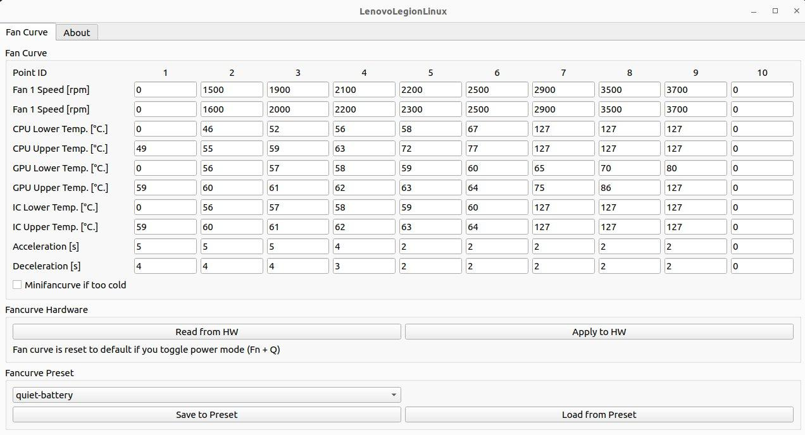
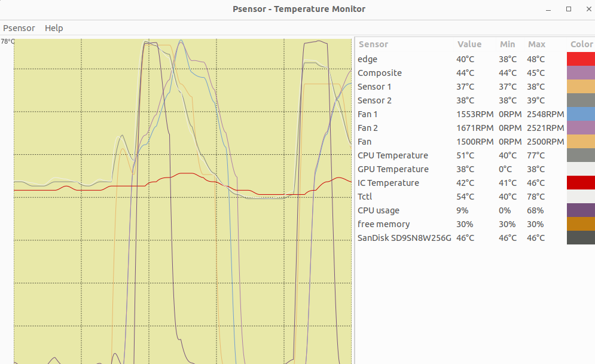
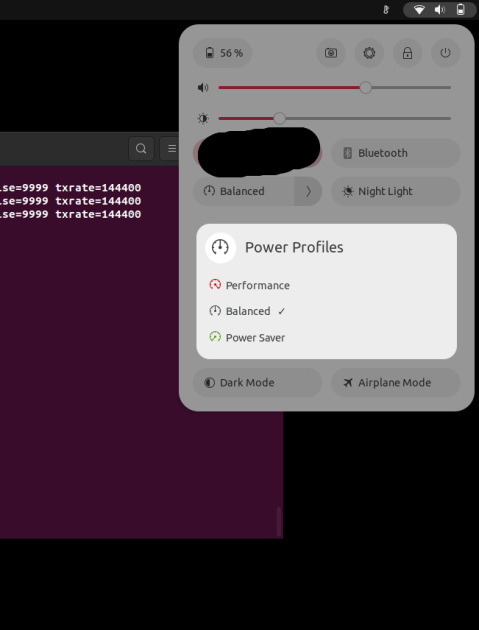

<h1 align="left">
  <a href="https://github.com/johnfanv2/LenovoLegionLinux" target="_blank">
    <picture>
      <source media="(prefers-color-scheme: light)" srcset="https://raw.githubusercontent.com/johnfanv2/LenovoLegionLinux/HEAD/doc/assets/legion_logo_dark.svg">
      <source media="(prefers-color-scheme: dark)" srcset="https://raw.githubusercontent.com/johnfanv2/LenovoLegionLinux/HEAD/doc/assets/legion_logo_light.svg">
      
    </picture>
  </a>
    <strong> 联想Legion Linux支持 </strong>
</h1> 

 

 

---
**本项目与联想没有任何关系**。

# 如果你有 2022 或 2023 型号的机器，请帮忙在[这里](https://github.com/johnfanv2/LenovoLegionLinux/issues/46)测试新功能。
# 如果你的机器的盖子（A 面 的 Y-logo）或 IO-ports（所有 Legion 7）上有灯，请帮忙在[这里](https://github.com/johnfanv2/LenovoLegionLinux/issues/54)测试对它的控制。

联想 Legion Linux (LLL) 为联想 Legion 系列笔记本电脑带来了更多的 Linux 驱动和工具，其为 Lenovo Vantage 或 Legion Zone（都是 Windows 系统）的替代品。

其允许控制一些功能，如风扇曲线和电源模式。

⭐ **如果这个库有用或将来可能有用，请 star 这个仓库**。

🌟 **我的目标是把驱动合并到 Linux 的主线内核中，这样它就会自动与 Linux 一起出现，在 Linux 更新后不需要重新编译**。

💥 **Starring 表明这对我和 Linux 社区是有用的，由此便有希望合并到内核中去。**

## 🚀 特点

    。
    
     

- [x] 对内存和 CPU 的光照，没有遥测。
- [x] 用于风扇曲线的小型 GUI ；其他功能由分布的 GUI 工具提供
- [x] 也可以通过脚本或终端进行完全控制
- [x] 设置一个功能齐全的自定义风扇曲线，最多 10 个点
    - 甚至允许速度低于1600RPM
    - 当风扇速度（水平）应该改变时设置温度点
    - 你可以用 CPU、GPU 和 IC 的温度来同时控制风扇
    - 设置每个级别的风扇速度(RPM)
    - 为每个级别设置最低温度，在再次降低风扇速度之前必须低于该温度。
    - 当风扇速度应该增加或减少时为每个风扇设置加速和减速。
    - 保存和加载不同模式的预设值
- [x] 用软件切换电源模式（安静、平衡、性能）。
    - 也可以用`Fn+Q`来改变
    - 现在你可以用常规系统设置中的软件来完成
    - 决定于你的分布，例如，你可以在使用电池时自动切换到安静模式。
    - 允许根据功率分布来改变不同的风扇分布（[Lenovo Legion Laptop Support Daemon](https://github.com/arttnba3/LenovoLegionLinux/tree/main#lenovo-legion-laptop-support-daemon)）
- [x] 通过额外的传感器监测风扇速度和 CPU、GPU、IC 的温度。
- [x] 锁定与解锁风扇控制器和风扇速度
- [x] 如果温度长时间处于低水平，启用或禁用自动切换到 "迷你风扇曲线"。
- [x] 通过软件切换电池保护模式；在交流电时将电池保持在50%左右，以延长电池寿命
- [x] 通过软件切换Fn锁；使用F1-F12键的特殊功能而不按Fn键
- [x] 通过软件启用或禁用触摸板

## :mega: 概述
- 其带有一个驱动（内核模块），实现了 Linux 的标准接口（sysfs, debugfs, hwmon）。
- 其使用标准的 Linux 接口从而与命令行/文件接口或标准的 GUI 工具（如 psensor）兼容。
- 相较于 Windows 的供应商工具，其甚至允许设置风扇曲线。这可以使风扇保持
    缓慢而安静地运行，而不是不断地在风扇关闭和较吵的风扇之间切换。非常适合在安静的办公室工作🏢。
  
  

## 📌 已确认的兼容型号

# 如果你有 2022 或 2023 型号的机器，请帮忙在[这里](https://github.com/johnfanv2/LenovoLegionLinux/issues/46)测试新功能。
# 如果你的机器的盖子（A 面 的 Y-logo）或 IO-ports（所有 Legion 7）上有灯，请帮忙在[这里](https://github.com/johnfanv2/LenovoLegionLinux/issues/54)测试对它的控制。

其他从 2020 年到 2023 年的联想 Legion 机型也可能可用。以下型号已经过验证。如果你的机型的 BIOS 版本有相同的前导字母，例如 EFCN（如EFCN54WW），那么它可能是可用的。如果你的型号不在列表中，或者不可用，请提出问题。
- 联想 Legion 5 15IMH05、15IMH05H（BIOS EFCN54WW）：传感器、风扇曲线、电源配置文件
- 联 想Legion 5 15ACH6H（BIOS GKCN58WW或GKCN57WW），第六代：传感器、风扇曲线、电源配置文件
- 联想军团 R9000（R9000K2021H）（BIOS GKCN59WW）：传感器、风扇曲线、电源配置文件
- 联想 Legion 5 Pro 16ACH6H (82JQ) (BIOS GKCN58WW) x 2：传感器、风扇曲线、电源配置文件
- Legion 5 Pro 16ACH6H (AMD 5800H + Nvidia RTX 3070)：传感器、风扇曲线、电源配置文件
- 联想 Legion 5 15ARH05A（BIOS FSCN14WW），第5代：传感器、风扇曲线
- 联想 Legion 5 15ARH05H（BIOS FSCN14WW），第5代：传感器、风扇曲线
- 联想 Legion 5 15ITH6H（BIOS H1CN49WW，Intel）：传感器、风扇曲线、电源配置文件
- 联想 Legion 5 15ARH7H（BIOS JUCN55WW），第7代：传感器、风扇曲线、电源配置文件
- 联想 Legion 5 15ACH6（BIOS HHCN31WW）：传感器、风扇曲线、电源配置文件
- 联想 Legion S7 16ARHA7（BIOS KFCN32WW）：传感器、风扇曲线（无迷你曲线）、电源配置文件
- 联想 Legion 5 Pro 16ITH6（BIOS H1CN52WW（H1CN51WW的CPU温度有错误））：传感器、风扇曲线、电源配置文件
- 联想 Legion 5 15ACH6A（BIOS G9CN30WW），所有AMD变体：传感器、风扇曲线（带迷你风扇曲线）、电源配置文件
- 联想军团5 17ACH6（BIOS HHCN31WW）：传感器、风扇曲线、电源配置文件
- 联想 Legion 7i 16ITHG6（BIOS H1CN35WW）：传感器、风扇曲线、电源配置文件

*注：*未被确认的功能可能也可用，只是尚未进行测试。

目前风扇控制对以下型号不起作用。其他功能，可能工作：
- 带有 BIOS HACN*的 Legion，例如 S7-15ACH6：[问题](https://github.com/johnfanv2/LenovoLegionLinux/issues/13)
- Legion Y530 和 Legion Y540：[问题](https://github.com/johnfanv2/LenovoLegionLinux/issues/16)
