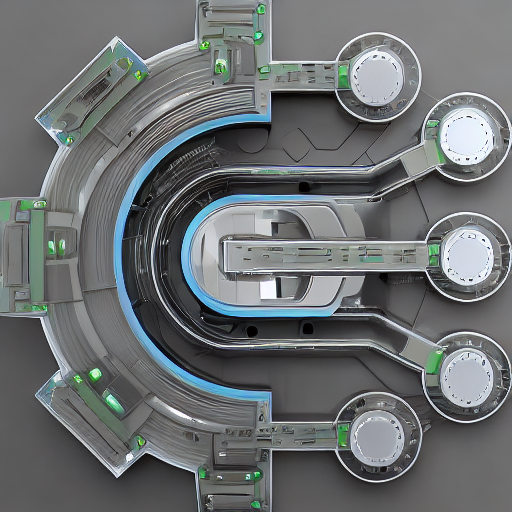

# 联想Legion Linux支持

---
**本项目与联想没有任何关系**。

# 如果你有2022或2023型号，请帮助测试新功能[这里](https://github.com/johnfanv2/LenovoLegionLinux/issues/46)。
# 如果你在盖子（Y-logo）或IO-ports（所有Legion 7）上有灯，请帮助测试控制它[这里](https://github.com/johnfanv2/LenovoLegionLinux/issues/54)。

联想Legion Linux (LLL)为联想Legion系列笔记本电脑带来了更多的驱动和工具到Linux。它
是Lenovo Vantage或Legion Zone（都是Windows系统）的替代品。

它允许控制一些功能，如风扇曲线和电源模式。

⭐ **如果这个库有用或将来可能有用，请给这个库加星 **。

🌟 **我的目标是把驱动合并到Linux的主内核中，这样它就会自动与Linux一起出现，在Linux更新后不需要重新编译**。

💥 **Starring表明这对我和Linux社区是有用的，所以希望能合并到内核中去。

## 🚀 特点

    。
    
     

- [x]对内存和CPU的光照，没有遥测。
- [x]用于风扇曲线的小型GUI；其他功能由分销的GUI工具提供
- [x] 也可以通过脚本或终端进行完全控制
- [x] 设置一个功能齐全的自定义风扇曲线，最多 10 个点
    - 甚至允许速度低于1600RPM
    - 设置温度点，当风扇速度（水平）应该改变时
    - 你可以用CPU、GPU和IC的温度来控制风扇，而且是在同一时间。
    - 设置每个级别的风扇速度(RPM)
    - 为每个级别设置最低温度，在再次降低风扇速度之前必须低于该温度。
    - 为每个风扇设置加速和减速，当风扇速度应该增加或减少时。
    - 保存和加载不同模式的预设值
- [x] 用软件切换电源模式（安静、平衡、性能）。
    - 也可以用`Fn+Q`来改变
    - 现在你可以在你的正常系统设置中用软件来做这件事
    - 根据你的分布，例如，如果你使用电池，你可以自动切换到安静模式。
- [x] 通过额外的传感器监测风扇速度和温度（CPU、GPU、IC）。
- [x] 锁定和解锁风扇控制器和风扇速度
- [x] 如果温度长时间处于低水平，启用或禁用自动切换到 "迷你风扇曲线"。
- [x] 通过软件切换电池保护模式；在交流电时将电池保持在50%左右，以延长电池寿命
- [x] 通过软件切换Fn锁；使用F1-F12键的特殊功能而不按Fn键
- [x] 通过软件启用或禁用触摸板

## :mega: 概述
- 它带有一个驱动（内核模块），实现了Linux的标准接口（sysfs, debugfs, hwmon）。
- 使用标准的Linux接口使得它与命令行/文件接口或标准的GUI工具（如psensor）兼容。
- 与Windows的供应商工具相比，它甚至允许设置风扇曲线。这可以使风扇保持
    缓慢而安静地运行，而不是不断地在风扇关闭和大风扇之间切换。非常适合安静的办公室工作。 :办公室：
  
  

## 📌 已确认的兼容型号

# 如果你有2022或2023型号，请帮助测试新功能[这里](https://github.com/johnfanv2/LenovoLegionLinux/issues/46)。
# 如果你在盖子（Y-logo）或IO-ports（所有Legion 7）上有灯，请帮助测试控制它[这里](https://github.com/johnfanv2/LenovoLegionLinux/issues/54)。

其他联想Legion机型从2020年到2023年可能也能工作。以下情况得到了证实。如果你的机型的BIOS版本有相同的前导字母，例如EFCN（如EFCN54WW），那么它可能会工作。如果你的型号不在列表中，或者不能工作，请提出问题。
- 联想Legion 5 15IMH05、15IMH05H（BIOS EFCN54WW）：传感器、风扇曲线、电源配置文件
- 联想Legion 5 15ACH6H（BIOS GKCN58WW或GKCN57WW），第六代：传感器、风扇曲线、电源配置文件
- 联想军团R9000（R9000K2021H）（BIOS GKCN59WW）：传感器、风扇曲线、电源配置文件
- 联想 Legion 5 Pro 16ACH6H (82JQ) (BIOS GKCN58WW) x 2：传感器、风扇曲线、电源配置文件
- Legion 5 Pro 16ACH6H (AMD 5800H + Nvidia RTX 3070)：传感器、风扇曲线、电源配置文件
- 联想Legion 5 15ARH05A（BIOS FSCN14WW），第5代：传感器、风扇曲线
- 联想Legion 5 15ARH05H（BIOS FSCN14WW），第5代：传感器、风扇曲线
- 联想Legion 5 15ITH6H（BIOS H1CN49WW，Intel）：传感器、风扇曲线、电源配置文件
- 联想Legion 5 15ARH7H（BIOS JUCN55WW），第7代：传感器、风扇曲线、电源配置文件
- 联想Legion 5 15ACH6（BIOS HHCN31WW）：传感器、风扇曲线、电源配置文件
- 联想Legion S7 16ARHA7（BIOS KFCN32WW）：传感器、风扇曲线（无迷你曲线）、电源配置文件
- 联想Legion 5 Pro 16ITH6（BIOS H1CN52WW（H1CN51WW的CPU温度有错误））：传感器、风扇曲线、电源配置文件
- 联想Legion 5 15ACH6A（BIOS G9CN30WW），所有AMD变体：传感器、风扇曲线（带迷你风扇曲线）、电源配置文件
- 联想军团5 17ACH6（BIOS HHCN31WW）：传感器、风扇曲线、电源配置文件
- 联想Legion 7i 16ITHG6（BIOS H1CN35WW）：传感器、风扇曲线、电源配置文件

*注：*未被确认的功能可能也能工作。它们只是没有被测试。

目前风扇控制对以下型号不起作用。其他功能，可能工作：
- 带有BIOS HACN*的Legion，例如S7-15ACH6：[问题](https://github.com/johnfanv2/LenovoLegionLinux/issues/13)
- Legion Y530 和 Legion Y540：[问题](https://github.com/johnfanv2/LenovoLegionLinux/issues/16)
